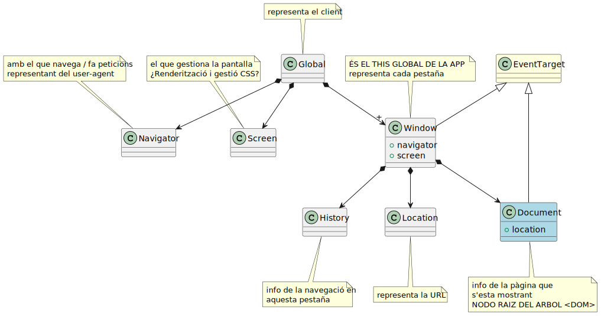
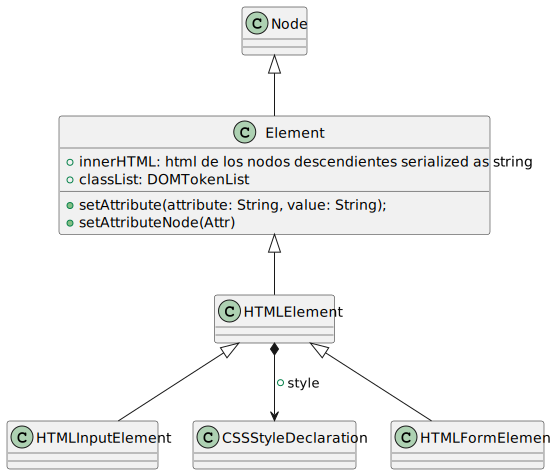

# DHTML
- Mis experimentos con esta tecnología

## Index
* [Jerarquia](#jerarquia)
    * [BOM](#bom)
    * [DOM](#dom)
    * [Nodos d'un document](#nodos-dun-document)
    * [Events](#events)
* [Gestió de nodes](#gestió-de-nodes)
    * [Node](#node)
    * [Document](#document)
* [Gestió d'elements](#gestió-delements)
    * [Element](#element)
* [Gestió d'events](#gestió-devents)
    * [EventTarget](#event-target)
* [Gestió d'estils](#gestió-destils)
    * [CSSStyleDeclaration](#cssdeclaration)

## Jerarquia

### BOM

### DOM

### Nodos d'un document

## Events

## Gestió de nodes

### Node

### Document

## Gestió d'elements

### Element

## Gestió d'Events

### Event Target

## Gestió d'Estils

### CSSStyleDeclaration
[!CSSStyleDeclaration](../../out/docs/dhtml/estil/CSSStyleDeclaration/declarationcss.svg)